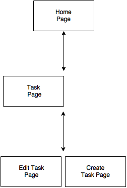
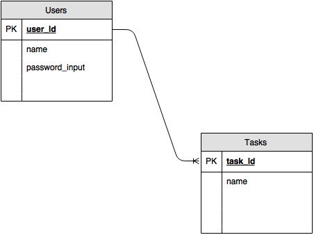

# toDoList.app
Crud app, created with Node & Express

The Main functionality of my app is to help people become more organized by allowing them to login from there phones and check, add, update delete there task.

I enjoyed working on this project and will add new functionality in the future. I would love to see a feature were you can as a user send your todo list to another people who are not using the app as a way to spark collaboration and call other new users to action to try the final app.

## What I Used To Make this app:

* Express.js
* Node.js
* JavaScript
* PostgreSQL
* HTML
* CSS
* Heroku

## Install my app locally
1. download this repo
2. do a `npm install --save`
3. after you have the node_modules from my package.json you must have a .env file to run the config settings below:

`DB_HOST= localhost
PORT = 3000
DB_PORT= 5432
DB_NAME= todo_db
SESSION_SECRET= developmentSecret
DB_USER= your_computer_username
DB_PASS= your_computer_password`

4. Download `PostgreSQL` and do a pgstart in the `terminal` for the database.
* Startup `psql` in the `terminal` and create a database named `todo_db` as stated in config above. Then `\c` to connect to `todo_db` and then load my scehma.sql file

5. Fire up `nodemon` and copy and past the url you are given. I set up my server to `consolelog` in the terminal the port to put in to browser to view localhost. Should look like below example.

`[user@MacBook-Pro-1 to-do-app (master)]$ nodemon
[nodemon] 1.8.1
[nodemon] to restart at any time, enter rs
[nodemon] watching: *.*
[nodemon] starting node server.js
http://127.0.0.1:3000/`

#Issues and Bugs of an app built in 48hrs.

I did ship minimally, but if you download the repository you will see the app is full CRUD and working. Below are the two issues I am still working on but will be apart of the app.

1. Currently the code for the signup feature is not working due to a few bugs but you can view the code on the repo. I ran out of time to debugg. I plan to fix these issues.

2. Lastly, I did deploy to heroku but as of now I am having database issues. The site loads but will not load the data base of todo_list task. I plan to fix this asap.

Link to where app is deployed: HEROKU ->
https://thawing-reaches-36384.herokuapp.com/

Link to this app's repo page:
WebDevJ ->
https://github.com/WebDevJ/to-do-app

#User Stories
You can find this in the repo our View below.

1. I as a user am prompted with landing page info that tells me what this app is.
2. I as a user see the CALL TO ACTION to SIGNUP as the 1st line link.
3. I as a user know when I am logged in and can easily see the form to fill out and create a new task.
4. I as a user can after creating my new task can see that same task added to the view of the "My task page".
5. I as a user can then update the status of any task. This button is clearly labeled "Status of Task".
6. I as a user can see clearly when I am in the edit/update view because the heading reads "EDIT" and the name of the task to be updated is present.
7. I as a user can change my mind and cancel a update or the creation of a new task. This button is clearly labeled on the same page as were the edit view or create view is being visited.

# Wire frames
#### toDoList.app Wire Frame chart:

#

# ERD's     
No one asked for this but no harm in doing the extra credit.
#### toDoList.app ERD chart:

#
